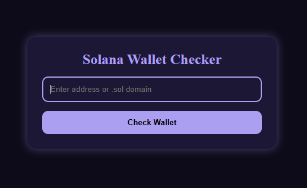

# 🟣 Solana Wallet Checker  
### A React + TypeScript tool for validating Solana wallet addresses and .sol domains

This project is a **Solana Wallet Checker** built with **React, TypeScript,and CSS**.  
It allows users to:

- Validate Solana public keys  
- Resolve `.sol` domain names  
- Detect PDA (Program Derived Addresses)  
- Check if an address exists on-chain  
- Display detailed warnings and explanations  
- Provide a clean UI using **Phantom-inspired colors**


## 📸 Screenshot


## 🚀 Features

- ✔ Validate Base58 Solana public keys  
- ✔ Resolve `.sol` domains using Bonfida Name Service  
- ✔ Detect PDAs and warn the user  
- ✔ Check whether an address exists on Mainnet  
- ✔ Phantom-style UI with animations  
- ✔ Mobile-responsive layout  
- ✔ Auto-clear input + results  
- ✔ Error messages + helpful explanations  

---

## 🛠️ Tech Stack

| Technology | Description |
|-----------|-------------|
| **React** | UI framework |
| **TypeScript** | Strong typing for better development |
| **@solana/web3.js** | Wallet + blockchain interaction |
| **@bonfida/spl-name-service** | Domain (.sol) resolution |
| **CSS** | Styling + animations |

---

## 📦 Installation
Clone the repository:
``` bash
git clone https://github.com/Enugu-Solana-Dev-Cohort/check-wallet-value-Egbujie-Chizoba-Esther.git
cd check-wallet-value-Egbujie-Chizoba-Esther
```
Install dependencies:

``` bash
npm install
```
Run the development server:

```bash
npm run dev
```
Build for production:
```bash 
npm run build
```
## 💡 How It Works

 - ✔ User enters a Solana wallet address or a .sol domain
- ✔ If .sol → it is resolved using Bonfida Name Service
- ✔ The app checks:
- ✔ Whether the format is a valid public key
- ✔ Whether the address exists on-chain
- ✔ Whether it is a PDA
- ✔ Results display with:
- ✔ Colors
- ✔ Icons
- ✔ Animations
- ✔ Explanations


